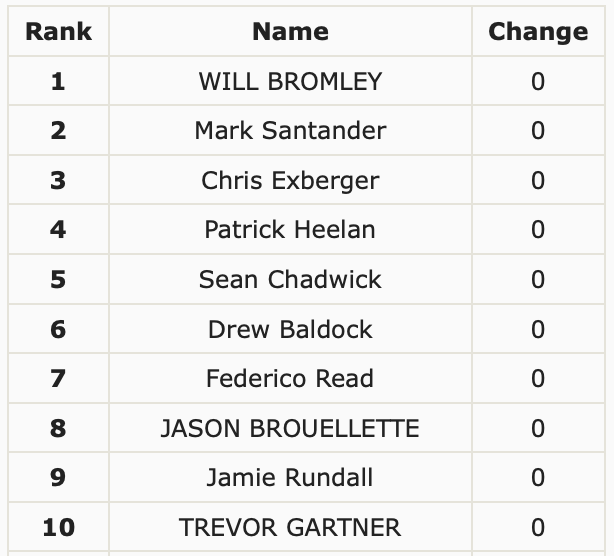

## Reddit Leaderboard Thing

Gets leaderboard from bigbuckhd and edits a Reddit submission with the results (top 100) in a table every n hours.



### Instructions

- Install requirements ```pip install -r requirements.txt```
- Create Reddit (script) app at https://www.reddit.com/prefs/apps/ and get your id, tokens etc
- Edit conf.ini with all your juicy details
- Run this first ```python3 firstrun.py```
- Then Run the main script ```python3 run.py```


### Info

```target_submission``` in conf.ini is the post id you want to update  
```schedule_hours``` in conf.ini determines when the script runs (every n hours)

DEMO: https://old.reddit.com/r/impshums/comments/cypgku/leaderboard/
